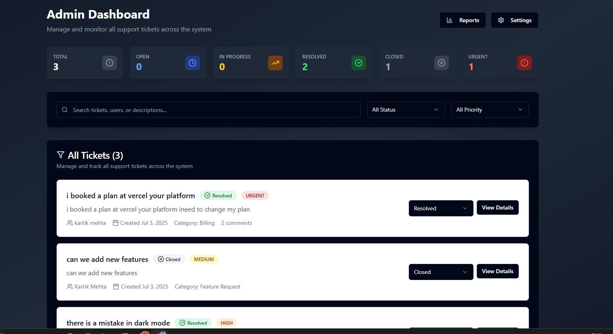

# ServiceDesk Pro 🎫

A modern, feature-rich customer support ticket management system built with React, TypeScript, and Firebase. ServiceDesk Pro provides an intuitive interface for managing customer inquiries, tracking ticket progress, and delivering exceptional support experiences.



## ✨ Features

### 🔐 Authentication & User Management
- **Google OAuth Integration** - Secure authentication with Google Sign-In
- **Role-based Access Control** - Admin and user role management
- **Profile Management** - User profile customization and settings

### 🎫 Ticket Management
- **Create & Track Tickets** - Submit support requests with detailed descriptions
- **Status Tracking** - Real-time ticket status updates (Open, In Progress, Resolved, Closed)
- **Priority Levels** - Categorize tickets by urgency (Low, Medium, High, Urgent)
- **Category System** - Organize tickets by type (Technical, Billing, General, Feature Requests)
- **Comments & Communication** - Interactive comment system for ticket discussions

### 👨‍💼 Admin Dashboard
- **Comprehensive Overview** - View all tickets across the organization
- **Advanced Filtering** - Search and filter tickets by status, priority, category
- **Ticket Assignment** - Assign tickets to specific support agents
- **Analytics & Statistics** - Track ticket metrics and performance

### 💳 Subscription Management
- **Multiple Plans** - Starter, Professional, and Enterprise tiers
- **Razorpay Integration** - Secure payment processing
- **Premium Features** - Priority support and advanced features for subscribers

### 🎨 User Experience
- **Dark/Light Mode** - Toggle between themes for optimal viewing
- **Responsive Design** - Optimized for desktop, tablet, and mobile devices
- **Modern UI** - Clean interface built with shadcn/ui components
- **Smooth Animations** - Enhanced user experience with Framer Motion

## 🚀 Tech Stack

### Frontend
- **React 18** - Modern React with hooks and functional components
- **TypeScript** - Type-safe development
- **Vite** - Fast build tool and development server
- **Tailwind CSS** - Utility-first CSS framework
- **shadcn/ui** - High-quality UI component library
- **Framer Motion** - Smooth animations and transitions

### Backend & Services
- **Firebase** - Backend-as-a-Service
  - Authentication (Google OAuth)
  - Firestore Database
  - Real-time updates
- **Razorpay** - Payment gateway integration

### Development Tools
- **ESLint** - Code linting and formatting
- **date-fns** - Date manipulation utilities
- **React Router** - Client-side routing
- **React Hook Form** - Form management

## 📦 Installation

### Prerequisites
- Node.js 18+ and npm
- Firebase account and project setup
- Razorpay account (for payment features)

### Quick Start

1. **Clone the repository**
   ```bash
   git clone <repository-url>
   cd request-resolve-spark-main
   ```

2. **Install dependencies**
   ```bash
   npm install
   ```

3. **Environment Setup**
   Create a `.env` file in the root directory:
   ```env
   VITE_FIREBASE_API_KEY=your_firebase_api_key
   VITE_FIREBASE_AUTH_DOMAIN=your_project.firebaseapp.com
   VITE_FIREBASE_PROJECT_ID=your_project_id
   VITE_FIREBASE_STORAGE_BUCKET=your_project.appspot.com
   VITE_FIREBASE_MESSAGING_SENDER_ID=your_sender_id
   VITE_FIREBASE_APP_ID=your_app_id
   VITE_RAZORPAY_KEY_ID=your_razorpay_key_id
   ```

4. **Firebase Setup**
   - Create a Firebase project at [Firebase Console](https://console.firebase.google.com)
   - Enable Authentication with Google provider
   - Create a Firestore database
   - Update Firebase configuration in `src/lib/firebase.ts`

5. **Start Development Server**
   ```bash
   npm run dev
   ```

6. **Build for Production**
   ```bash
   npm run build
   ```

## 🏗️ Project Structure

```
src/
├── components/          # Reusable UI components
│   ├── ui/             # shadcn/ui components
│   ├── Navbar.tsx      # Navigation component
│   ├── ThemeToggle.tsx # Dark/light mode toggle
│   └── ...
├── contexts/           # React context providers
│   ├── AuthContext.tsx # Authentication state
│   ├── ThemeContext.tsx# Theme management
│   └── TicketContext.tsx# Ticket management
├── pages/              # Page components
│   ├── Dashboard.tsx   # User dashboard
│   ├── AdminDashboard.tsx# Admin interface
│   ├── CreateTicket.tsx# Ticket creation
│   ├── Login.tsx       # Authentication
│   └── ...
├── services/           # API services
│   ├── ticketService.ts# Ticket operations
│   └── userService.ts  # User operations
├── lib/                # Utilities and configuration
│   ├── firebase.ts     # Firebase configuration
│   └── utils.ts        # Helper functions
└── utils/              # Additional utilities
    └── payment.ts      # Payment processing
```

## 🎯 Usage

### For End Users
1. **Sign Up/Login** - Use Google authentication to access the platform
2. **Create Tickets** - Submit support requests with detailed information
3. **Track Progress** - Monitor ticket status and communicate via comments
4. **Manage Profile** - Update personal information and view ticket history

### For Administrators
1. **Dashboard Overview** - View all tickets and system statistics
2. **Ticket Management** - Assign, update, and resolve customer tickets
3. **User Management** - Oversee user accounts and permissions
4. **Analytics** - Track support metrics and performance

## 💼 Subscription Plans

| Feature | Starter | Professional | Enterprise |
|---------|---------|--------------|------------|
| Monthly Tickets | 100 | 500 | Unlimited |
| Support Level | Email | Priority | 24/7 Premium |
| Team Members | 2 | 10 | Unlimited |
| Advanced Analytics | ❌ | ✅ | ✅ |
| Custom Integrations | ❌ | ❌ | ✅ |

## 🔧 Configuration

### Firebase Setup
Refer to `FIREBASE_SETUP.md` for detailed Firebase configuration instructions.

### Theme Customization
The application supports extensive theming through Tailwind CSS and CSS custom properties defined in `src/index.css`.

### Payment Configuration
Update Razorpay credentials in the environment variables and `src/utils/payment.ts`.

## 🤝 Contributing

1. Fork the repository
2. Create a feature branch (`git checkout -b feature/amazing-feature`)
3. Commit your changes (`git commit -m 'Add some amazing feature'`)
4. Push to the branch (`git push origin feature/amazing-feature`)
5. Open a Pull Request

## 📝 License

This project is licensed under the MIT License - see the [LICENSE](LICENSE) file for details.

## 🙏 Acknowledgments

- [shadcn/ui](https://ui.shadcn.com/) for the beautiful UI components
- [Firebase](https://firebase.google.com/) for backend services
- [Razorpay](https://razorpay.com/) for payment processing
- [Lucide React](https://lucide.dev/) for icons

## 📞 Support

For support, email support@servicedeskpro.com or create an issue in this repository.

---

**Built with ❤️ by the ServiceDesk Pro Team**
